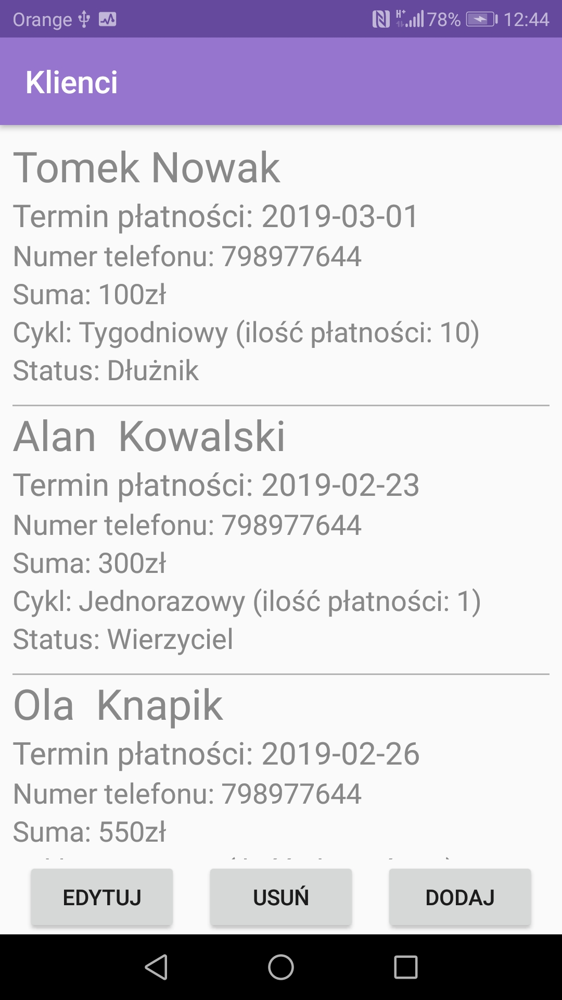

# PracaDyplomowa

Made by Marcin Brzeziński

This application has been made as a help for people who run small businesses. It allows to store data about clients, shows coming payments, visuals money distribution and also creates notifications for a user and sends SMS to clients.

Here are some screenshots from applications.

           
